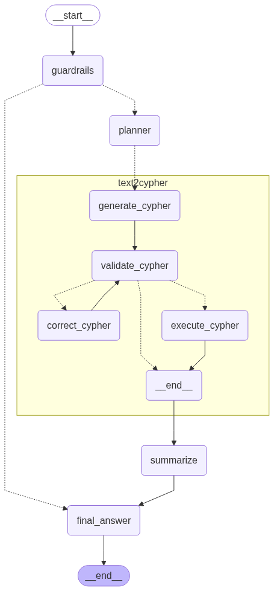
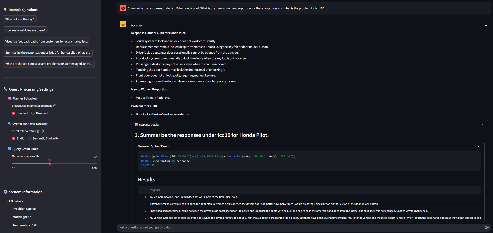
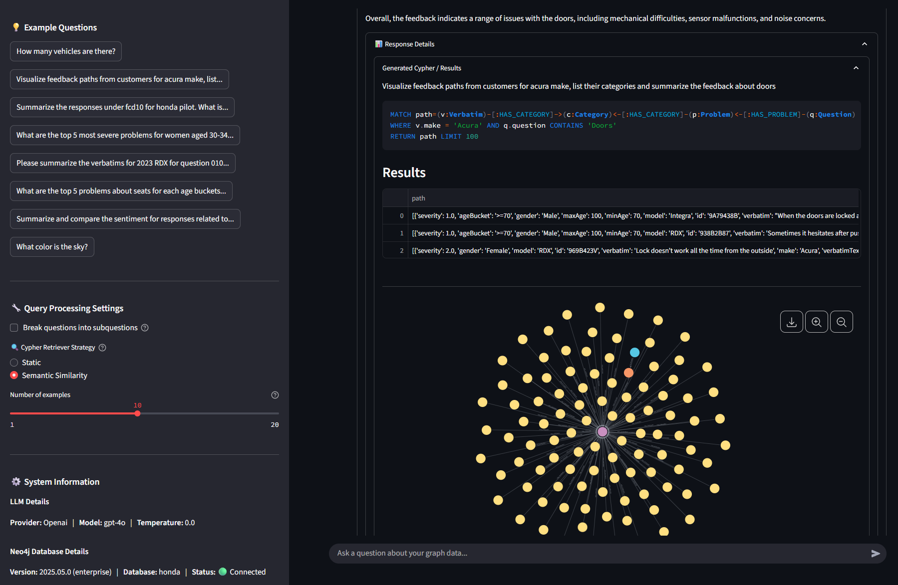

# Neo4j Text2Cypher

This repository contains the `neo4j-text2cypher` package which may be used to create off-the-shelf agentic workflows built for Neo4j. The purpose of this repo is to provide foundational agents and workflows that may function with any underlying Neo4j graph. While these workflows should function well on their own - it is expected that they will be augmented to serve more specific use cases once pulled into other projects.

This package uses the [LangChain](https://github.com/langchain-ai) library for LLM and database connections.

This package uses [LangGraph](https://github.com/langchain-ai/langgraph) for workflow orchestration.

This project and structure is based on the work by Alex Gilmore and the repository can be found [here](https://github.com/neo4j-field/ps-genai-agents)

## Contents

This repository contains
* Predefined agentic workflow for Text2Cypher usage
* Streamlit Demo Application
* Example Notebook

## Architecture

The Neo4j Text2Cypher system is built on **LangGraph** and follows a modular workflow design with comprehensive error handling. The system converts natural language questions into Cypher queries through a multi-stage pipeline:

```
Question → 🛡️ Guardrails → 🧠 Planner → 🔄 Text2Cypher → 📝 Summarize → Answer
```

### Core Components

- **🛡️ Guardrails**: Validates questions are within scope using graph schema
- **🧠 Planner**: Intelligently handles question complexity with two configurable modes (via UI toggle):
  - **Break into subquestions** (default): Analyzes complex questions and decomposes them into smaller, focused sub-questions for parallel processing and better accuracy
  - **Passthrough mode**: Treats the entire question as a single task for direct processing, ideal for simple queries or when decomposition isn't needed
- **🔄 Text2Cypher Pipeline**: Multi-stage query processing with comprehensive validation
  - **Generation** (`generate_cypher`): Creates Cypher queries using retrieval-augmented few-shot examples with configurable retrieval strategies:
    - **Static retrieval**: Uses all configured examples from `example_queries`
    - **Semantic similarity**: Selects most relevant examples from configured `example_queries` using in memory vector similarity (configurable K value) using the configured llm
  - **Validation** (`validate_cypher`): Multi-layer validation (syntax, security, semantic correctness)
  - **Correction** (`correct_cypher`): Iterative error fixing with max attempt limits
  - **Execution** (`execute_cypher`): Safe query execution with result gathering and automatic graph visualization
- **📝 Summarization**: Formats raw results into natural language responses
- **✅ Final Answer**: Output formatting and conversation history management

### Workflow Diagram



*The diagram above shows the complete LangGraph workflow with all components and decision points, including the detailed Text2Cypher pipeline with generation, validation, correction, and execution steps.*

#### Key Data Flow Details:

**🛡️ Guardrails**: Validates question scope using graph schema
- **Reject Path**: Routes directly to Final Answer with "out of scope" message  
- **Accept Path**: Passes to Planner with validated input

**🧠 Planner**: Processes questions based on selected mode
- **Break into subquestions mode**: Decomposes complex questions into executable sub-tasks for parallel processing
- **Passthrough mode**: Creates a single task from the original question for direct processing
- **Output**: Array of Task objects with `task` and `prev_steps` fields
- **Routing**: Distributes tasks to Text2Cypher pipeline in parallel

**🔄 Text2Cypher Pipeline**: Multi-stage processing with configurable retrieval
- **Generate**: Creates Cypher using selected retrieval strategy (static or semantic similarity) → `statement`, `steps[]`
- **Validate**: Multi-layer validation (syntax, security, semantic) → `errors[]`, `next_action`, `attempts++`
- **Correct**: LLM-based error fixing → corrected `statement`, loops back to Validate
- **Execute**: Safe database execution → `records[]`, with automatic graph visualization for compatible results

**📝 Summarize**: Aggregates all query results into natural language
- **Input**: Array of `CypherOutputState` objects with database results
- **Output**: Human-readable response with comprehensive result formatting

**✅ Final Answer**: Formats output and updates conversation history
- **Output**: Complete `OutputState` with answer, cypher details, and updated history

## Quick Start

### 1. Installation

```bash
git clone <repository-url>
cd neo4j-text2cypher
make init  # or poetry install --with dev,ui
```

The installation includes optional dependency groups:
- `dev`: Development tools (pytest, ruff, mypy for testing and code quality)
- `ui`: Streamlit dependencies for the web interface
- Base installation: Core Neo4j Text2Cypher functionality and LangGraph workflow

### 2. Environment Setup

Copy the environment template and add your credentials:

```bash
cp .env.example .env
```

Edit `.env` with your Neo4j and LLM provider credentials:

```env
NEO4J_USERNAME="neo4j"
NEO4J_PASSWORD="your_password"
NEO4J_URI="bolt://localhost:7687"
NEO4J_DATABASE="neo4j"

# OpenAI Configuration
OPENAI_API_KEY="sk-your_openai_key"

# Azure OpenAI Configuration (alternative to OpenAI)
AZURE_OPENAI_API_KEY="your-azure-api-key"
AZURE_OPENAI_ENDPOINT="https://your-resource.openai.azure.com/"
AZURE_OPENAI_API_VERSION="2024-02-15-preview"
```

#### Configuration Precedence

The system uses a hierarchical configuration approach where **environment variables override YAML settings**:

**Neo4j Connection:**
- **Environment variables** (highest priority): `NEO4J_USERNAME`, `NEO4J_PASSWORD`, `NEO4J_URI`, `NEO4J_DATABASE`
- **YAML fallback**: Values in `neo4j:` section of your config file
- **Required**: At minimum, you need either environment variables OR YAML settings for all four Neo4j parameters

**LLM Provider Requirements:**

For **OpenAI**:
- **Required in .env**: `OPENAI_API_KEY="sk-your_openai_key"`
- **Required in YAML**: `llm.provider: "openai"` and `llm.model: "gpt-4o"`

For **Azure OpenAI**:
- **Required in .env**: `AZURE_OPENAI_API_KEY`, `AZURE_OPENAI_ENDPOINT`, `AZURE_OPENAI_API_VERSION`
- **Required in YAML**: `llm.provider: "azure_openai"` and `llm.model: "your-deployment-name"`

### 3. Configure Your Application

Create or edit your application configuration file (e.g., `example_apps/iqs_data_explorer/app-config.yml`):

```yaml
# Neo4j connection settings (environment variables take precedence)
neo4j:
  uri: "bolt://localhost:7687"
  username: "neo4j"
  password: "password"
  database: "your_database_name"
  enhanced_schema: true  # Enable enhanced schema features

# Language model configuration
llm:
  provider: "openai"  # Options: "openai", "azure_openai"
  model: "gpt-4o"     # Model name or deployment name
  temperature: 0      # Response randomness (0.0-1.0)

streamlit_ui:
  title: "Your App Name"
  scope_description: "Description of what your app can answer"
  example_questions:
    - "How many customers do we have?"
    - "What products are available?"

example_queries:
  - question: "How many customers do we have?"
    cql: "MATCH (c:Customer) RETURN count(c) as customerCount"
  - question: "What products are available?"
    cql: "MATCH (p:Product) RETURN p.name as productName LIMIT 10"
```

**LLM Provider Examples:**

For **OpenAI**:
```yaml
llm:
  provider: "openai"
  model: "gpt-4o"
  temperature: 0
```

For **Azure OpenAI**:
```yaml
llm:
  provider: "azure_openai"
  model: "your-deployment-name"  # Your Azure deployment name
  temperature: 0
```

The configuration file combines all settings in one place:
- **Neo4j settings**: Database connection details with enhanced schema caching for fast startup
- **LLM configuration**: Provider, model, and temperature settings
- **UI configuration**: App title, description, and example questions
- **Query examples**: Question-Cypher pairs for few-shot learning and retrieval-augmented generation

### 4. Project Structure

```
neo4j-text2cypher/
├── neo4j_text2cypher/                      # Main package
│   ├── components/                         # LangGraph node components
│   │   ├── guardrails/                     # Input validation and scope checking
│   │   ├── planner/                        # Question decomposition with configurable modes
│   │   ├── text2cypher/                    # Core text2cypher pipeline
│   │   │   ├── generation/                 # Cypher query generation with RAG
│   │   │   ├── validation/                 # Multi-layer validation
│   │   │   ├── correction/                 # Error correction with LLM feedback
│   │   │   └── execution/                  # Safe query execution
│   │   ├── summarize/                      # Natural language response formatting
│   │   └── final_answer/                   # Final output generation
│   ├── retrievers/                         # Example retrieval systems
│   │   ├── config_retriever.py             # Configuration-based example retriever
│   │   └── similarity_retriever.py         # Semantic similarity-based retriever
│   ├── workflows/                          # LangGraph workflow definitions
│   │   ├── single_agent/                   # Single-agent text2cypher workflow
│   │   └── neo4j_text2cypher_workflow.py   # Main workflow factory
│   ├── ui/                                 # Streamlit web interface
│   │   ├── components/                     # UI components
│   │   │   ├── chat.py                     # Enhanced chat interface
│   │   │   ├── sidebar.py                  # Sidebar with query processing controls
│   │   │   └── visualization.py            # Graph visualization (50-node limit)
│   │   └── streamlit_app.py                # Main Streamlit application with caching
│   └── utils/                              # Utility functions
│       ├── config.py                       # Unified configuration management
│       ├── llm_factory.py                  # Multi-provider LLM factory
│       ├── schema_cache.py                 # High-performance schema caching
│       └── schema_utils.py                 # Neo4j schema processing utilities
├── database_schema_cache/                  # Auto-generated schema cache directory
├── example_apps/                           # Example applications
│   └── iqs_data_explorer/                  # Sample app with configuration
│       ├── app-config.yml                  # Complete application configuration
│       └── iqs_data_explorer_example.ipynb # Jupyter notebook example
└── docs/                                   # Documentation and images
```

### 5. Run the Application

#### Streamlit Web App
```bash
make streamlit file_path=example_apps/iqs_data_explorer/app-config.yml
```

#### Jupyter Notebook
```bash
jupyter notebook example_apps/iqs_data_explorer/iqs_data_explorer_example.ipynb
```

## User Interface

The Streamlit web application provides an intuitive interface for interacting with your Neo4j database through natural language queries.

### Application Overview

### Sidebar Components

#### 💡 Example Questions
- **Purpose**: Quick-start queries to demonstrate system capabilities
- **Source**: Configured in `streamlit_ui.example_questions` section of your config file
- **Behavior**: Click any question to automatically submit it to the chat

#### ⚙️ System Information
- **LLM Details**: Shows current provider (OpenAI/Azure OpenAI), model name, and temperature setting
- **Neo4j Database Details**: Displays database version, edition, database name, and connection status
- **Dynamic Updates**: Neo4j version information is queried live from your database

#### 🔧 Query Processing Settings
- **Break questions into subquestions**: Toggle between intelligent question decomposition (default) and direct passthrough mode for simple queries
- **Cypher Retriever Strategy**: Choose between "Static" (uses all configured examples) and "Semantic Similarity" (in-memory cosine similarity using your configured LLM's embeddings to select most relevant examples)
- **Number of examples**: When using semantic similarity, control how many examples to retrieve (1-20, shown only when semantic similarity is selected)
- **Real-time Updates**: Changes take effect immediately and rebuild the workflow while preserving database connections
- **Performance Optimization**: Settings are optimized for different query types and complexity levels

### Chat Interface

The main chat interface includes several enhanced features:

#### Loading Experience
- **Thinking Status**: Shows processing indicator while queries are being executed
- **Clean Transitions**: Previous responses are hidden during new query processing

#### Response Organization
- **Main Response**: Primary answer to your question in natural language
- **Response Details**: Collapsible section containing:
  - Generated Cypher queries with syntax highlighting
  - Query execution results in interactive DataFrames
  - Automatic graph visualizations for compatible queries (limited to 50 nodes for optimal performance)
  - Clean organization for both single and multi-query responses

#### Interactive Elements
- **Expandable Sections**: All technical details are collapsible for clean reading
- **Copy-Friendly Code**: Cypher queries are displayed in formatted code blocks
- **Data Export**: Query results displayed in interactive Streamlit DataFrames

### Standard Query Interface


*Standard data query interface showing natural language response with expandable query details*

### Visualization Query Interface


*Graph visualization query showing interactive network diagram with nodes and relationships*

## Examples

See `example_apps/iqs_data_explorer/iqs_data_explorer_example.ipynb` for a complete walkthrough including:
- Environment setup and initialization
- Workflow creation and configuration
- Example queries with step-by-step execution
- Result analysis and customization tips
- Testing different validation approaches

The example demonstrates a real-world use case with Honda/Acura vehicle feedback data, showing:
- Complex multi-hop queries
- Filtering and aggregation patterns
- Natural language result formatting
- Error handling and correction

## License
Apache License, Version 2.0